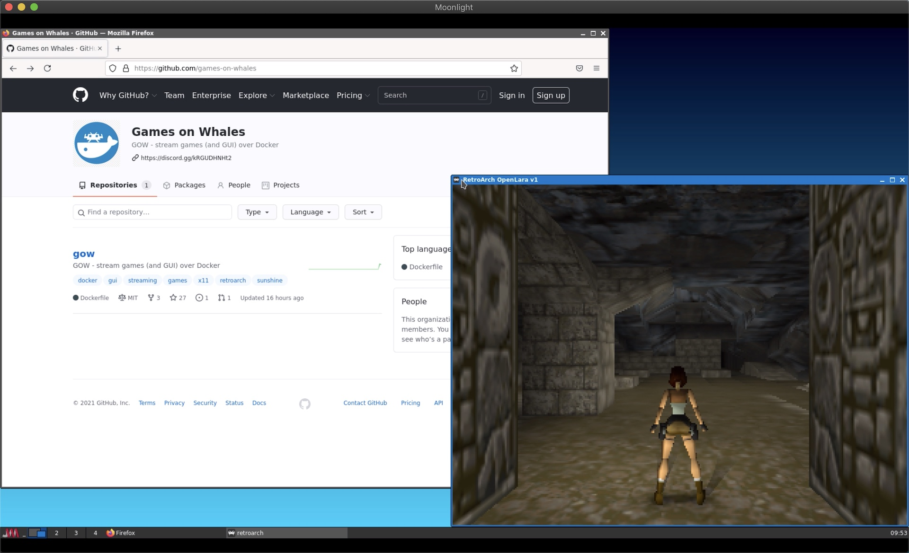

# GOW - Games on Whales [](https://discord.gg/kRGUDHNHt2)

Stream games (and GUI) over Docker with HW acceleration and low latency



## Quickstart

```console
git clone https://github.com/games-on-whales/gow.git
cd gow
docker-compose pull
docker-compose up
```

Connect over Moonlight by manually adding the IP address of the PC running the Docker container. To validate the PIN you can use the Sunshine web interface (at `https://<IP>:47990/` username: sunshine, password is auto generated on startup check the docker logs.) or directly calling: `curl <IP>:47989/pin/<PIN>`.

From Moonlight open the `Desktop` app, from there you should be able to see your X11 apps running!


## RetroArch first time configuration

> Using the keyboard you can move using the arrows and get back to the previous menu by pressing backspace

From the **Main Menu** > **Online Updater** select:
- Update Core Info Files
- Update assets

Press `F` to toggle fullscreen.


## GPU HW acceleration

> **TESTING**: the following is still under development

### Nvidia GPUs with `nouveau` drivers

Make sure that the host doesn't use proprietary drivers but it's using the open source `nouveau` drivers.
```
sudo lshw -class video | grep driver=
       configuration: driver=nouveau latency=0
```

Double check that the GPU card is correctly listed under `/dev/dri/`:
```
ls -la /dev/dri/
total 0
drwxr-xr-x  3 root root        100 Jun 20 09:47 .
drwxr-xr-x 17 root root       3100 Jun 20 10:33 ..
drwxr-xr-x  2 root root         80 Jun 20 09:47 by-path
crw-rw----  1 root video  226,   0 Jun 20 09:47 card0
crw-rw----  1 root render 226, 128 Jun 20 09:47 renderD128
```

### Nvidia GPUs with proprietary drivers

You can see if your host is using the proprietary driver using `lshw`:
```console
$ lshw -class video | grep -i driver
       configuration: driver=nvidia latency=0
```

In order to make use of your GPU inside docker containers, you'll need to set up the [NVIDIA Container Toolkit](https://github.com/NVIDIA/nvidia-docker).

Once that's done, you can run the container, you should add the following ENV variables to the docker-compose file

```yaml
environment: 
    NVIDIA_VISIBLE_DEVICES: GPU-[uuid] # Replace [uuid] (see the instructions)
    NVIDIA_DRIVER_CAPABILITIES: utility,graphics,video,display
```

To get the correct UUID for your GPU, use the `nvidia-container-cli` command:
```console
$ sudo nvidia-container-cli --load-kmods info
NVRM version:   [version]
CUDA version:   11.3

Device Index:   0
Device Minor:   0
Model:          NVIDIA GeForce [model]
Brand:          GeForce
GPU UUID:       GPU-[uuid]
Bus Location:   00000000:0a:00.0
Architecture:   7.5
```

##### Xorg drivers

Although the NVIDIA Container Toolkit automatically provides most of the drivers needed to use the GPU inside a container, Xorg is _not_ officially supported.  This means that the runtime will not automatically map in the specific drivers needed by Xorg.

There are two libraries needed by Xorg: `nvidia_drv.so` and `libglxserver_nvidia.so.[version]`.  It is preferred to map these into the container as a bind volume from the host, because this guarantees that the version will exactly match between the container and the host.  Locate the two modules and add a section like this to the `xorg` service in your `docker-compose.yml`:
```yaml
volumes:
  - /path/to/nvidia_drv.so:/nvidia/xorg/nvidia_drv.so:ro
  - /path/to/libglxserver_nvidia.so.[version]:/nvidia/xorg/libglxserver_nvidia.so:ro
```

Be sure to replace `[version]` with the correct version number from the `nvidia-container-cli` command above.

Some common locations for `nvidia_drv.so` include:
 * `/usr/lib64/xorg/modules/drivers/` (Unraid)
 * `/usr/lib/x86_64-linux-gnu/nvidia/xorg/` (Ubuntu 20.04)

Some common locations for `libglxserver_nvidia.so.[version]` include:
 * `/usr/lib64/xorg/modules/extensions/` (Unraid)
 * `/usr/lib/x86_64-linux-gnu/nvidia/xorg/` (Ubuntu 20.04)

If you don't want to do this, or if you can't find the driver on your host for some reason, the container will attempt to install the correct version for you automatically.  However, there is no guarantee that it will be able to find a version that exactly matches the driver version on your host.

If for some reason you want to skip the entire process and just assume the driver is already installed, you can do that too:
```yaml
environment:
    SKIP_NVIDIA_DRIVER_CHECK: 1
```

## Troubleshooting

You can access Retroarch logs at `~/retroarch/retroarch.log`

### Error: Could not create Sunshine Mouse: No such file or directory

Make sure that `/dev/uinput/` is present in the host and that it does have the correct permissions:

```console
ls -la /dev/uinput
crw-rw---- 1 $USER input 10, 223 Jun  9 08:57 /dev/uinput # Check that $USER is not root but your current user
```

Try following this: https://github.com/chrippa/ds4drv/issues/93#issuecomment-265300511
(On Debian I had to modify `/etc/modules-load.d/modules.conf`, adding `/etc/modules-load.d/uinput.conf` didn't trigger anything to me)

Non permanent fix:
```console
sudo chmod 0660 /dev/uinput
```

## Docker build

You can either build the docker image or use the pre-built one available at [DockerHub](https://hub.docker.com/u/gameonwhales).

To build it locally run:

```console
docker-compose build
```
