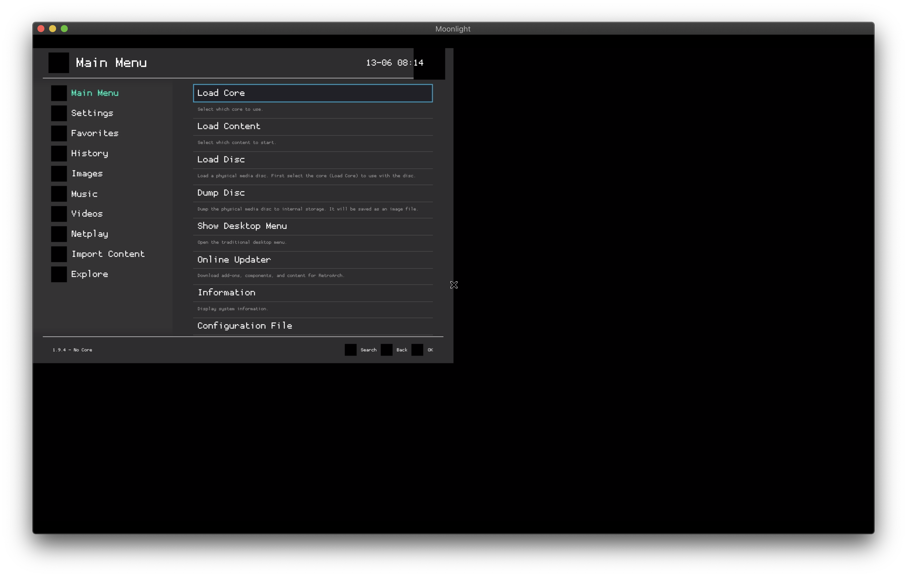
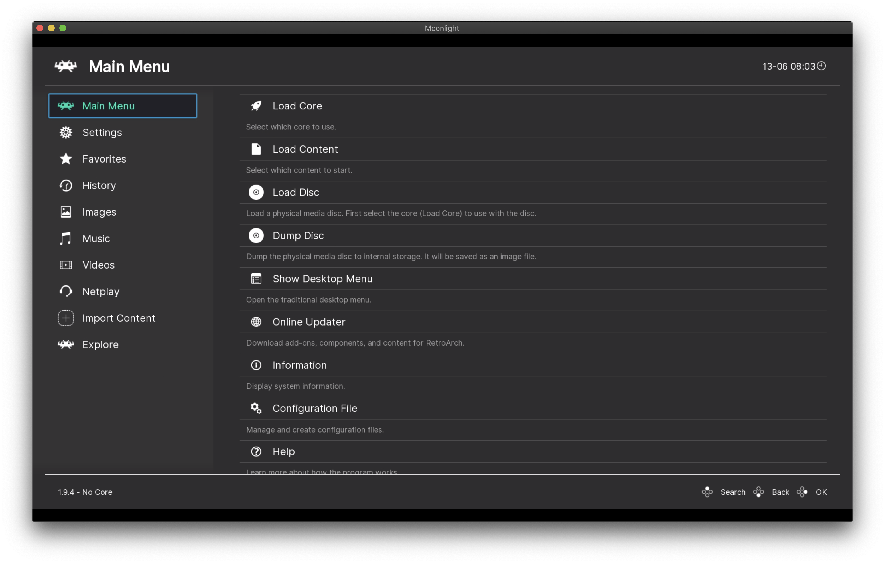

# ABeltramo/retroarch-docker

Running [RetroArch](https://www.retroarch.com/) on Docker with [Sunshine](https://github.com/loki-47-6F-64/sunshine) so that you can connect to it using [Moonlight](https://moonlight-stream.org/) on any supported client.


## Quickstart

```console
docker run -it --rm \
    --name retroarch \
    -p 47984-47990:47984-47990/tcp \
    -p 48010:48010 \
    -p 48010:48010/udp \
    -p 47998-48000:47998-48000/udp \
    --volume ~/retroarch:/retroarch/ \
    --device /dev/uinput \
    --env RESOLUTION=1920x1080x24 \
    --env LOG_LEVEL=INFO \
    abeltramo/retroarch
```

Connect over Moonlight by manually adding the IP address of the PC running the Docker container. To validate the PIN you can use the Sunshine web interface (at `https://<IP>:47990/` username: sunshine password is auto generated on startup check the docker logs.) or directly calling: `curl <IP>:47989/pin/<PIN>`.

From Moonlight start RetroArch, you should be able to see the main UI:




## RetroArch first time configuration

> Using the keyboard you can move using the arrows and get back to the previous menu by pressing backspace

From the **Main Menu** > **Online Updater** select:
- Update Core Info Files
- Update assets

Get back to **Settings** > **Video** > **Fullscreen Mode** set **Start in Fullscreen Mode** to **ON**

This should make the window take the full screen, giving you a nice result like:



## GPU HW acceleration

> **TESTING**: the following is still under development

Pull the `:gpu` tag in order to try out hardware acceleration using the GPU.

### Nvidia GPUs with `nouveau` drivers

Make sure that the host doesn't use proprietary drivers but it's using the open source `nouveau` drivers.
```
sudo lshw -class video | grep driver=
       configuration: driver=nouveau latency=0
```

Double check that the GPU card is correctly listed under `/dev/dri/`:
```
ls -la /dev/dri/
total 0
drwxr-xr-x  3 root root        100 Jun 20 09:47 .
drwxr-xr-x 17 root root       3100 Jun 20 10:33 ..
drwxr-xr-x  2 root root         80 Jun 20 09:47 by-path
crw-rw----  1 root video  226,   0 Jun 20 09:47 card0
crw-rw----  1 root render 226, 128 Jun 20 09:47 renderD128
```

```console
docker run -it --rm \
    --name retroarch \
    -p 47984-47990:47984-47990/tcp \
    -p 48010:48010 \
    -p 48010:48010/udp \
    -p 47998-48000:47998-48000/udp \
    --volume ~/retroarch:/retroarch/ \
    --privileged \ # needed all devices for now
    --env RESOLUTION=1920x1080x24 \
    --env LOG_LEVEL=INFO \
    abeltramo/retroarch:gpu # make sure to pick :gpu tag
```
### Nvidia GPUs with proprietary drivers

You can see if your host is using the proprietary driver using `lshw`:
```console
$ lshw -class video | grep -i driver
       configuration: driver=nvidia latency=0
```

In order to make use of your GPU inside docker containers, you'll need to set up the [NVIDIA Container Toolkit](https://github.com/NVIDIA/nvidia-docker).

Once that's done, you can run the container:
```console
docker run --runtime=nvidia -it --rm \
    --name retroarch \
    -p 47984-47990:47984-47990/tcp \
    -p 48010:48010 \
    -p 48010:48010/udp \
    -p 47998-48000:47998-48000/udp \
    --volume ~/retroarch:/retroarch/ \
    --privileged \ # needed all devices for now
    --env RESOLUTION=1920x1080x24 \
    --env LOG_LEVEL=INFO \
    --env NVIDIA_VISIBLE_DEVICES=GPU-[uuid] \
    --env NVIDIA_DRIVER_CAPABILITIES=utility,graphics,video,display \
    abeltramo/retroarch:gpu
```

To get the correct UUID for your GPU, use the `nvidia-container-cli` command:
```console
$ sudo nvidia-container-cli --load-kmods info
NVRM version:   465.27
CUDA version:   11.3

Device Index:   0
Device Minor:   0
Model:          NVIDIA GeForce [model]
Brand:          GeForce
GPU UUID:       GPU-[uuid]
Bus Location:   00000000:0a:00.0
Architecture:   7.5
```

##### Xorg drivers

Because Nvidia does not officially support running Xorg inside a container with their Container Toolkit, it does not automatically provide you with the `nvidia_drv.so` driver module that Xorg requires.  The preferred method for making it available inside the container is to map it in from the host as a bind volume.  This ensures it is always the correct version. Find the module on your host, then add a volume mapping like this to your `docker run` command:
```console
--volume /path/to/nvidia_drv.so:/nvidia/xorg/nvidia_drv.so:ro
```

Some common locations for `nvidia_drv.so` include:
 * /usr/lib64/xorg/modules/drivers/nvidia_drv.so (Unraid)
 * /usr/lib/x86_64-linux-gnu/nvidia/xorg/nvidia_drv.so (Ubuntu 20.04)

If you don't want to do this, or if you can't find the driver on your host for some reason, the container will attempt to install the correct version for you automatically.  However, there are some drawbacks: first, it can take a long time, and second, there is no guarantee that it will be able to find a version that exactly matches the driver version on your host.

If the automatic option is working for you and you want to speed up future launches of the container, you can provide a persistent volume for it to cache some of the setup work, using a mapping like this:
```console
--volume ~/dr-cache:/var/cache/dummy
```

If for some reason you want to skip the entire process and just assume the driver is already installed, you can do that too:
```console
--env SKIP_NVIDIA_DRIVER_CHECK=1
```

## Troubleshooting

You can access Retroarch logs at `~/retroarch/retroarch.log`

### Error: Could not create Sunshine Mouse: No such file or directory

Make sure that `/dev/uinput/` is present in the host and to pass `--device /dev/uinput` to the docker run command.

If this is not enough, make sure that `/dev/uinput` have the correct permissions.
Try following this: https://github.com/chrippa/ds4drv/issues/93#issuecomment-265300511
(On Debian I had to modify `/etc/modules-load.d/modules.conf`, adding `/etc/modules-load.d/uinput.conf` didn't trigger anything to me)
```console
ls -la /dev/uinput
crw-rw---- 1 $USER input 10, 223 Jun  9 08:57 /dev/uinput # Check that $USER is not root but your current user
```
Non permanent fix:
```console
sudo chmod 0660 /dev/uinput
```

## Docker build

You can either build the docker image or use the pre-built one available at [DockerHub](https://hub.docker.com/r/abeltramo/retroarch).

To build it locally run:

```console
sudo docker build -t abeltramo/retroarch .
```
