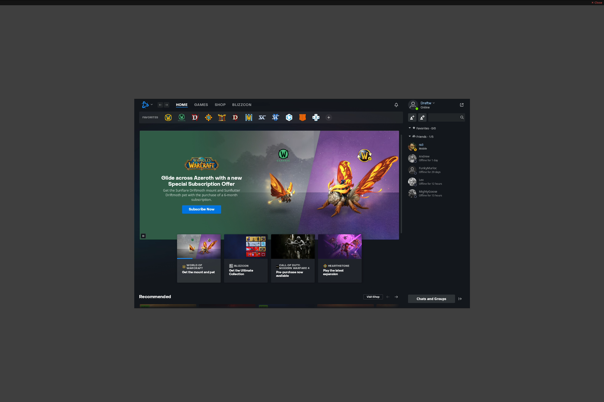

# Battle.net



Blizzard's game launcher for World of Warcraft, Diablo, Overwatch, Call of Duty, and more.

## How it works

The image bakes a full Battle.net installation (Agent + Battle.net.exe) into the Docker image at build time using Wine Staging 11.1. On first launch, the prefix is copied to persistent storage so login credentials and game installations survive container restarts.

## Configuration

```toml
[[apps]]
title = "Battle.net"
start_virtual_compositor = true

[apps.runner]
type = "docker"
image = "ghcr.io/games-on-whales/battlenet:edge"
mounts = ["/path/to/battlenet-persist:/home/retro-persist:rw"]
env = [
    "GOW_REQUIRED_DEVICES=/dev/dri/* /dev/nvidia*",
    "XDG_RUNTIME_DIR=/tmp/runtime-retro",
    "RUN_SWAY=true"
]
```

## Notes

- First launch copies ~1.5GB Wine prefix to persistent storage (takes a few seconds on SSD/ZFS)
- Battle.net UI uses `--disable-gpu` for CEF rendering compatibility; games themselves use GPU normally
- Login persists across restarts via the persistent mount
- Tested with Diablo III, should work with other Blizzard/Activision titles
- Region/locale configurable in startup.sh (default: enGB, EU)
