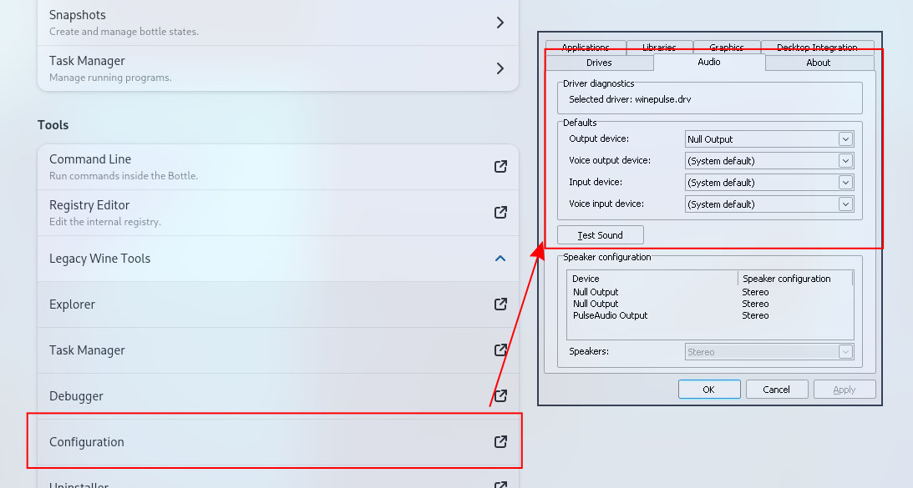

# Bottles

Bottles lets you run Windows software on Linux, such as applications and games. It introduces a workflow that 
helps you organize by categorizing each software to your liking. Bottles provides several tools and 
integrations to help you manage and optimize your applications.

Read more about it at: https://usebottles.com/

### Audio Issues

If you do not have any audio output:

1. Expand Legacy Wine Tools
2. Open Configuration
3. Open the Audio tab
4. Change the Output device and click "Test Sound" until it works.

