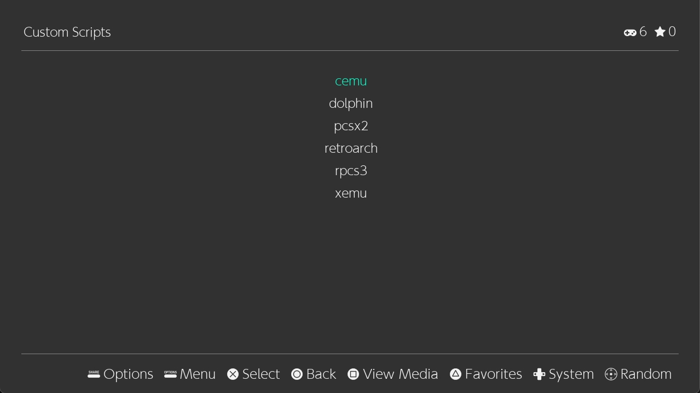

# Emulation Station Desktop Edition

A graphical front-end for managing and launching game emulators.
It offers an intuitive interface for organizing and playing retro games from various consoles.

## Nintendo Switch (Eden)

Switch ROMs are launched with [Eden](https://eden-emu.dev) (the Switch emulator shipped in `base-emu`). On first launch a default `qt-config.ini` is seeded (fullscreen UI, Switch gamedir at `/ROMs/switch`); after that Eden owns its config. Eden reads its data from the user home, so mount your own keys and firmware there:

| Purpose | Path |
| --- | --- |
| Config (seeded) | `~/.config/eden/qt-config.ini` |
| Keys (`prod.keys`) | `~/.local/share/eden/keys/` |
| Firmware (NAND, registered) | `~/.local/share/eden/nand/system/Contents/registered/` |
| ROMs | `/ROMs/switch` |

Switch games require keys and firmware dumped from your own console; these are not provided.
