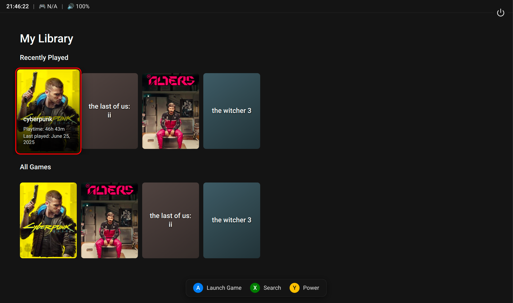

# Lutris Gamepad UI



An open-source. simple, TV-friendly, gamepad-navigable frontend for the Lutris game launcher on Linux. This application provides a "10-foot UI" designed for couch gaming, allowing you to browse and launch your Lutris library entirely with a gamepad.

### Check the original repository for more details
[lutris-gamepad-ui](https://github.com/andrew-ld/lutris-gamepad-ui)

# Easy Setup
If you already have the [WolfLutris](https://games-on-whales.github.io/wildlife/apps/lutris/) app configured. Edit the app profile in the .toml file by changing the image to:
```
image = 'docker.io/hashimhs/gamepadui:alpha'
```

Optionally change the title and icon:
```
title = 'Gamepad UI'
icon_png_path = "https://raw.githubusercontent.com/HashimHS/gow/refs/heads/gamepadui/apps/gamepad-ui/assets/icon.png"
```
Restart Wolf.

# Manual lutris configuration
Mount your lutris config and game directories. Paths are same as WolfLutris. Check the relevant directories at [startup-10-create-dirs.sh](build/scripts/startup-10-create-dirs.sh)

Proper documentation is coming soon (I would appreciate any help through PR)...

# Current limitations
- You can not open lutris from the Gamepad UI.
- In-game overlay does not pop up when pressing the home button while in game. The in-game overlay provides options to pause/resume (freeze game state) or forcefully close the game.