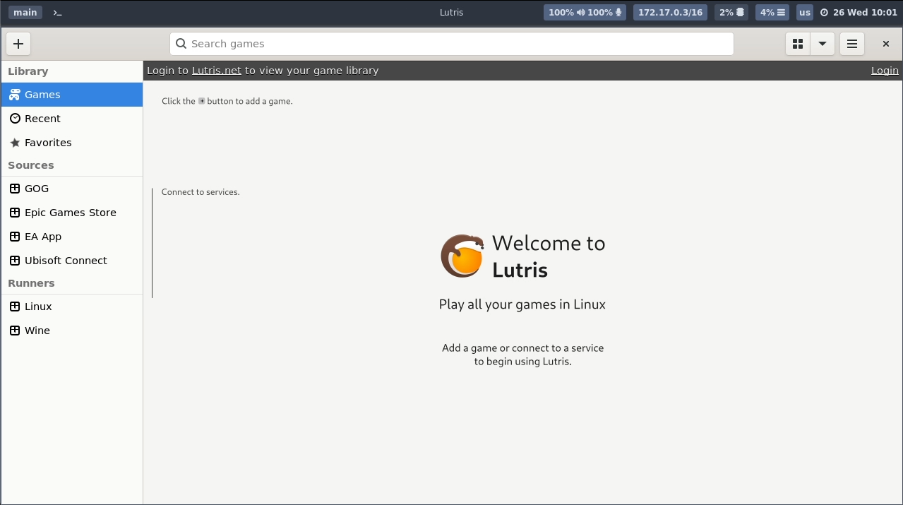
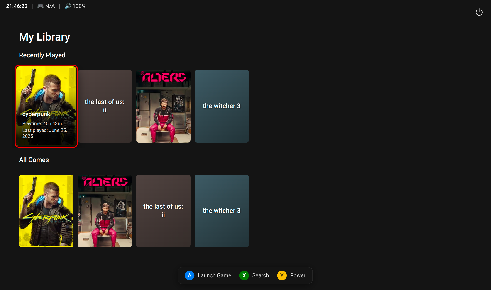

# Lutris

An open-source gaming platform for Linux that allows you to install and manage games from various sources,
including Steam, GOG, and more.
It simplifies the process of running games on Linux.

# Gamepad-UI

By default Wolf's Lutris image uses a frontend UI that is gamepad friendly with access to runner settings.

The classic Lutris window can be opened from the Gamepad UI menu. The Gamepad UI can be disabled by setting the environment variable `WOLF_LUTRIS_GAMEPAD_UI_ENABLE=0` in the `config.toml` file.