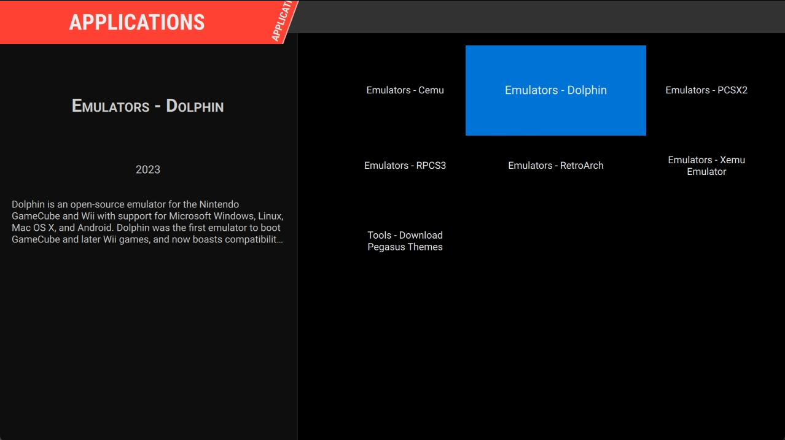

# Pegasus Front-end



Pegasus is a powerful and flexible frontend for launching games, similar to EmulationStation. It provides a unified
interface for interacting with various emulators, eliminating the need to manage multiple emulator interfaces
separately.

## Getting Started

### ROM Directory Structure

By default, Pegasus is configured to look for ROMs in the `/ROMs` directory, with subdirectories for each platform. You
can either create the ROM directories in the format below or edit Pegasus to use your preferred location.

{}

```
/ROMs/3do
/ROMs/amiga
/ROMs/amigacd32
/ROMs/arcade
/ROMs/atari2600
/ROMs/atari5200
/ROMs/atari7800
/ROMs/atarijaguar
/ROMs/atarijaguarcd
/ROMs/atarilynx
/ROMs/atarist
/ROMs/gb
/ROMs/gba
/ROMs/gbc
/ROMs/gc
/ROMs/genesis
/ROMs/megacd
/ROMs/model2
/ROMs/model3
/ROMs/n64
/ROMs/naomi
/ROMs/neogeo
/ROMs/nes
/ROMs/ngp
/ROMs/ngpc
/ROMs/ps2
/ROMs/ps3
/ROMs/psp
/ROMs/psx
/ROMs/saturn
/ROMs/scummvm
/ROMs/sega32x
/ROMs/segacd
/ROMs/snes
/ROMs/snes_widescreen
/ROMs/switch
/ROMs/virtualboy
/ROMs/wii
/ROMs/wiiu
/ROMs/wonderswan
/ROMs/wonderswancolor
/ROMs/xbox
```

{}

### Setting Up ROM Directories

To make your roms accessible to Pegasus within the container, you need to create a bind mount that maps your host ROM
folder to the `/ROMs` directory in the container.
This is done by editing the `config.toml` file; ex:

```toml 
mounts = [
    "/mnt/PATH_TO_ROMS_IN_YOUR_HOST/:/ROMs/:rw" # <-- EDIT HERE
]
```
## Special Notes

### Setting up the `pegasus.metadata.txt` file

There is a `rom_launcher.sh` script to make life easier. When using it, as long as you use the same folder name
used for the ROM it'll be able to find it. For example, for PS3:

```text
collection: Sony Playstation 3
shortname: ps3
command: /Applications/launchers/rom_launcher.sh ps3 "{file.path}"

...
```

### PS3 games

ISOs are supported! Just use the above `rom_launcher.sh` script.

**NOTES**:
- Mounting ISOs to a folder requires FUSE (Filesystem in Userspace) to be setup on the host system.
- You must set `"Privileged": true` in the `.toml` configuration file for mounting the ISO to work properly!

### ScummVM

ScummVM will work with zip files if you use the `rom_launcher.sh` script!

You must first prepare the zip file for this to work correctly:
- Add the complete game in the root of the zip file
- Add a `*.scummvm` file inside of the root of the zip file.
  - This file must contain the official "name" that ScummVM associates with this game
  - This name can be found in the following [yaml file](https://github.com/scummvm/scummvm-web/blob/master/data/en/games.yaml)
    - It is the `id` portion that comes after the `:`.
      - For example:
          ```yaml
            -
              id: 'scumm:tentacle'
              name: 'Maniac Mansion: Day of the Tentacle'
              engine_id: scumm
              company_id: lucasarts
              year: '1993'
              moby_id: '719'
              steam_id: ''
              gog_id: ''
              zoom_id: ''
              additional_stores: ''
              datafiles: Day_of_the_Tentacle
              wikipedia_page: Day_of_the_Tentacle
              series_id: maniac
          ```
        `tentacle` would be what you would put on the first line of the `*.scummvm` file 

**NOTES**:
- Mounting ISOs to a folder requires FUSE (Filesystem in Userspace) to be setup on the host system.
- You must set `"Privileged": true` in the `.toml` configuration file for mounting zip files to work properly!

## Customization

### Theming

Pegasus supports extensive customization through themes. You can change the look and feel of your frontend to suit your
preferences.

- For a demonstration of different themes, watch this https://www.youtube.com/watch?v=WYAgfutLbVE[YouTube video].
- Browse and download themes from the official https://pegasus-frontend.org/tools/themes/[Pegasus Themes Gallery].

To install a theme, you need to launch the Pegasus app at least once, then download the theme and place in:

`<hostapps_folder>/Pegasus/.config/pegasus-frontend/themes`

On the next Pegasus launch, you will be able to select the theme from within the settings.

## Troubleshooting and Additional Resources

If you encounter any issues or need more information, consider the following resources:

- Official Pegasus Documentation: https://pegasus-frontend.org/docs/
- Pegasus FAQ: https://pegasus-frontend.org/docs/faq/
- Community Forums: https://pegasus-frontend.org/community/

For specific issues related to this container or its configuration, please refer to the project's issue tracker or
community support channels.