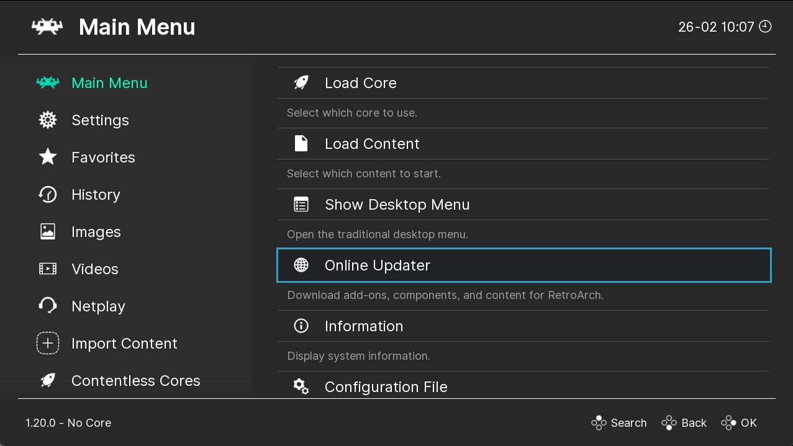

# Retroarch

An open-source, multi-platform emulator that supports a wide range of classic gaming systems.
It provides a unified interface for playing retro games and offers advanced features like shaders and netplay.
