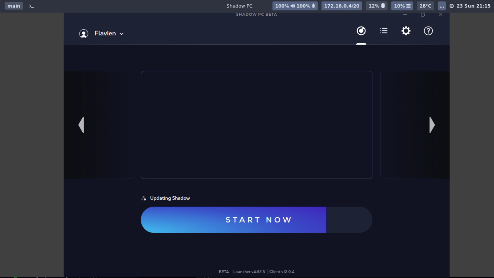

# ShadowPC

A cloud computing service that provides access to a powerful remote Windows PC.
Stream a high-end Windows desktop to your device, enabling you to run Windows applications, 
play games, and use productivity software remotely.

## Prerequisites

ShadowPC requires an active subscription to use the service.
Visit [shadow.tech](https://shadow.tech) to sign up or manage your subscription.

## Features

- Access a full Windows PC remotely
- High-performance gaming capabilities
- Run Windows-only applications on any device
- Cloud-based gaming with low latency
