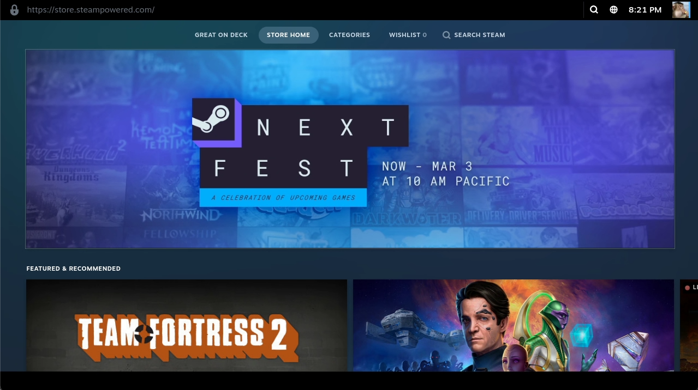

# Steam



A digital distribution platform for purchasing and playing video games.
It offers a vast library of games, community features, and cloud saving.

## Customization

### Directly launch a Steam game

In order to directly launch a Steam game from Moonlight you can just copy the existing `[[apps]]` entry for Steam,
change the name and just add the Steam app ID as env variable; example:

```toml
[[apps]]
title = "Elden Ring"
start_virtual_compositor = true

[apps.runner]
env = [
    "PROTON_LOG=1",
    "RUN_SWAY=true",
    "GOW_REQUIRED_DEVICES=/dev/input/* /dev/dri/* /dev/nvidia*",
    "STEAM_STARTUP_FLAGS=steam://rungameid/1245620"
]
# COPY EVERYTHING ELSE FROM THE DEFAULT CONFIG BELOW...
```

You can get the app ID from https://steamdb.info/

### Custom CLI flags

By default, Steam is set to use `-bigpicture` to open up in Big Picture mode.
You can override that (or pass any other flags) by setting the env variable `STEAM_STARTUP_FLAGS`.
See the full list of available flags [here](https://developer.valvesoftware.com/wiki/Command_line_options)

### MangoHud

The steam overlay currently **does not work** in our headless container.
So if you want to see FPS and other stats you can use FlightlessMango's
excellent [MangoHud](https://github.com/flightlessmango/MangoHud).

{}

Whilst `mangohud` is already installed, there's no way to globally enable it for all games.
You can still enable it on a per-game basis by adding `mangohud %command%` to the game's launch options in Steam.

{}

#### Activation and configuration

In a game, you can press `Right Shift` + `F12` to make the overlay appear and disappear.
You can also press `Right Shift` + `F11` to change the position of the overlay on screen.