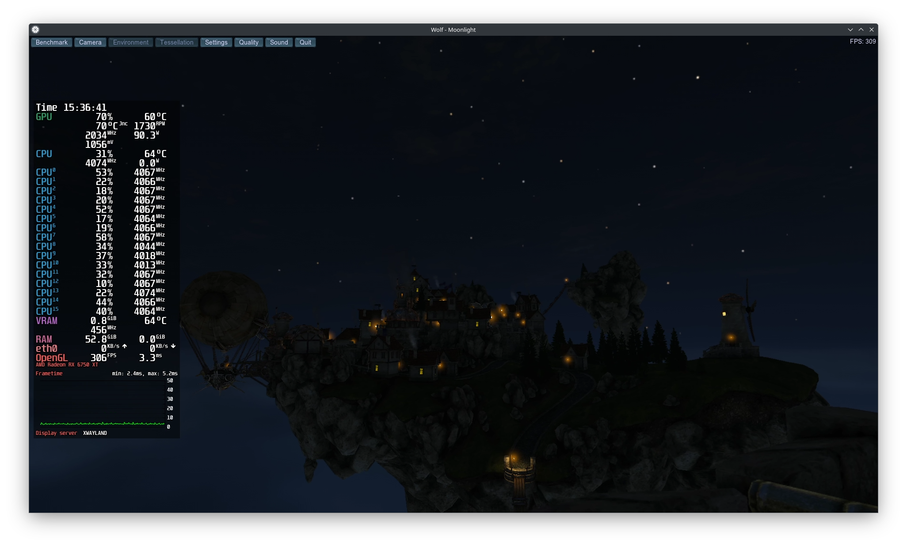

# Unigine Benchmarks

A collection of industry-standard GPU benchmarks: **Heaven**, **Valley**, and **Superposition**.

These benchmarks are used to stress-test and evaluate the performance and stability of your graphics hardware under demanding graphical workloads. This image is useful for overclocking or undervolting your GPU in a headless Wolf setup, allowing you to change your clockspeeds and voltages and directly test them using Wolf.

Each benchmark is downloaded directly from Unigine's official servers at runtime, ensuring compliance with licensing requirements.

> **By using this image, you accept the EULAs for each benchmark:**
> - [Heaven EULA](https://benchmark.unigine.com/policies/heaven-eula)
> - [Valley EULA](https://benchmark.unigine.com/policies/valley-eula)
> - [Superposition EULA](https://benchmark.unigine.com/policies/superposition-eula)

The container does **not** redistribute any Unigine binaries.

## Environment Variables

- `UNIGINE_BENCHMARK` — Select which benchmark to run. Options: `heaven` (default), `valley`, `superposition`.
- `FORCE_REINSTALL` — Set to `1` to force re-download and reinstall the selected benchmark.
- `DISABLE_MANGOHUD` — Disables MangoHud, by default MangoHud is enabled with the `detailed` preset (4).
