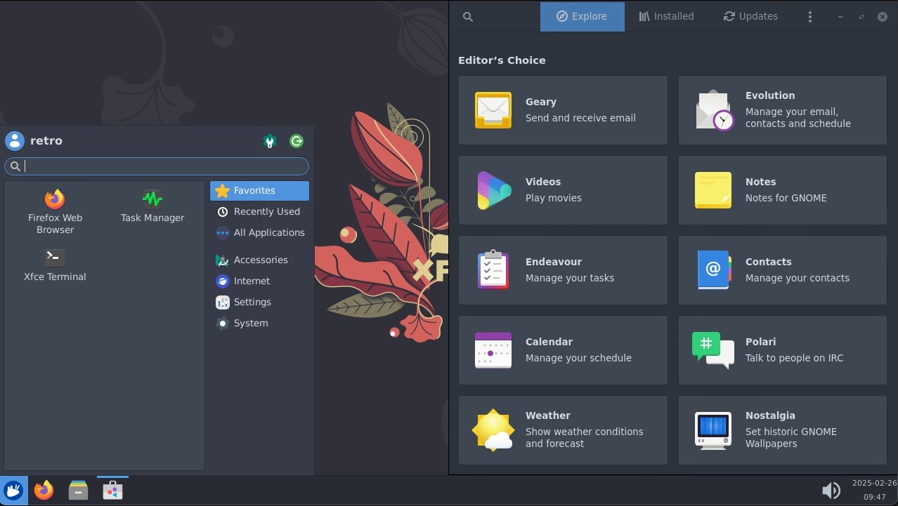

# Desktop (XFCE) - Development Edition



A lightweight desktop environment for Unix-like operating systems with pre-installed development tools.
It aims to be fast and low on system resources while being visually appealing and user-friendly.

## Pre-installed Development Applications

This enhanced XFCE desktop comes with essential development tools pre-installed:

### 🎮 **Game Development**
- **Unity Hub** - Unity game engine management platform
- **Steam** - Gaming platform for testing and playing games

### 💻 **Development Tools**
- **Visual Studio Code** - Modern code editor with extensions support
- **Google Chrome** - Web browser for web development and testing
- **Git** - Version control system
- **Node.js & NPM** - JavaScript runtime and package manager
- **Python 3** - Programming language with pip package manager
- **Java JDK** - Java development kit
- **Mono & .NET 8.0** - Cross-platform .NET development

### 📁 **File Management**
- **Thunar** - Enhanced file manager with advanced permissions
- **Full file system access** - Read/write access to all directories
- **Archive support** - Handle ZIP, 7Z, TAR, and other formats
- **Network storage** - Mount and access network drives
- **USB/External drives** - Automatic mounting and access

## Installing applications

In this configuration, XFCE is set up to use **Flatpak in user mode** by default.  
Flatpak is a software utility for software
deployment, package management, and application virtualization for Linux. By using Flatpak in user mode, users can
install and manage applications from the Flatpak store without needing administrative privileges or modifying the base
Docker image.  
This setup enhances flexibility and security, as users can add or remove applications independently of the
underlying system.

### Additional Software Installation

You can install additional software using multiple methods:

1. **APT Package Manager** (with root access):
   ```bash
   sudo apt update
   sudo apt install package-name
   ```

2. **Flatpak Applications**:
   ```bash
   flatpak install flathub application-name
   ```

3. **Snap Packages**:
   ```bash
   sudo snap install application-name
   ```

4. **AppImages** - Just download and run
5. **Manual Installation** - Full root access for custom software

## Persistent Data Storage

The container includes persistent volume mounts for:

- **`/home/retro`** - Complete user home directory
- **`/home/retro/Projects`** - Development projects storage
- **`/home/retro/Unity`** - Unity projects and assets
- **`/home/retro/.config/Code`** - VS Code settings and extensions
- **`/home/retro/.local/share/Steam`** - Steam games and data
- **`/shared/projects`** - Shared project directory

All data persists between container restarts and updates.

## Desktop Features

### Quick Access
- **Desktop shortcuts** for all development tools
- **Taskbar icons** for frequently used applications
- **File manager** with bookmarks to project directories
- **Terminal access** with development aliases

### Development Environment
- **Code-friendly file associations** - Files open in appropriate editors
- **Git integration** - Pre-configured for version control
- **Project templates** - Quick start templates for common projects
- **Environment variables** - Development paths pre-configured

## Root Access

For advanced system administration tasks, this XFCE configuration provides several ways to gain root privileges:

1. **Full sudo access**: The `retro` user has passwordless sudo access to all commands
2. **Root shell script**: Run `root-shell` from any terminal to switch to a root shell
3. **Container runs privileged**: The Docker container runs with elevated privileges and full system access

**Security Note**: The container runs with `Privileged: true` and extensive capabilities, providing near-complete system access within the containerized environment.

## Development Workflow

### Unity Game Development
1. **Launch Unity Hub** from desktop or applications menu
2. **Install Unity Editor** versions as needed
3. **Create projects** in `/home/retro/Unity/` directory
4. **Version control** with Git integration

### Web Development
1. **Open VS Code** for project editing
2. **Use Chrome** for testing and debugging
3. **Terminal access** for npm, pip, and other tools
4. **Live preview** and hot-reload support

### General Development
1. **Clone repositories** with Git
2. **Edit in VS Code** with IntelliSense and extensions
3. **Build and test** using integrated terminals
4. **Debug** with built-in debugging tools

## File Manager Rights

The file manager (Thunar) has full read/write access to:

- ✅ **User home directory** (`/home/retro/`)
- ✅ **Project directories** (`/home/retro/Projects/`)
- ✅ **Unity projects** (`/home/retro/Unity/`)
- ✅ **Shared storage** (`/shared/`)
- ✅ **External drives** (auto-mounted in `/media/`)
- ✅ **Network shares** (SMB, NFS, etc.)
- ✅ **System directories** (with root access via sudo)

### Folder Operations
- **Create/delete** folders and files
- **Copy/move** data between directories
- **Archive/extract** files (ZIP, TAR, 7Z, etc.)
- **Mount/unmount** external storage
- **Network browsing** and file sharing
- **Permission management** for files and folders

## Customization

### Adding More Applications
```bash
# Install via package manager
sudo apt install application-name

# Install via Flatpak
flatpak install flathub com.application.name

# Install AppImage
wget -O /opt/application.AppImage https://example.com/app.AppImage
chmod +x /opt/application.AppImage
```

### VS Code Extensions
Extensions are automatically installed and persist across sessions:
```bash
code --install-extension ms-python.python
code --install-extension ms-vscode.cpptools
```

### Desktop Customization
- **Themes and icons** can be changed via Settings
- **Panel configuration** for taskbar layout
- **Keyboard shortcuts** for development workflow
- **Multiple workspaces** for project organization

This development-ready XFCE desktop provides everything needed for Unity game development, web development, and general programming tasks with full file system access and persistent storage.
